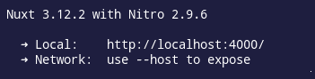
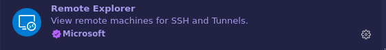
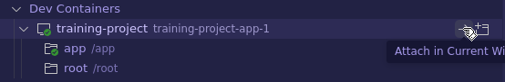
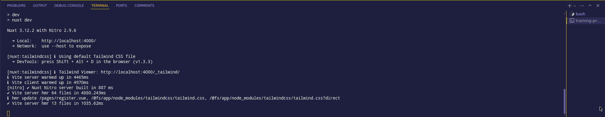
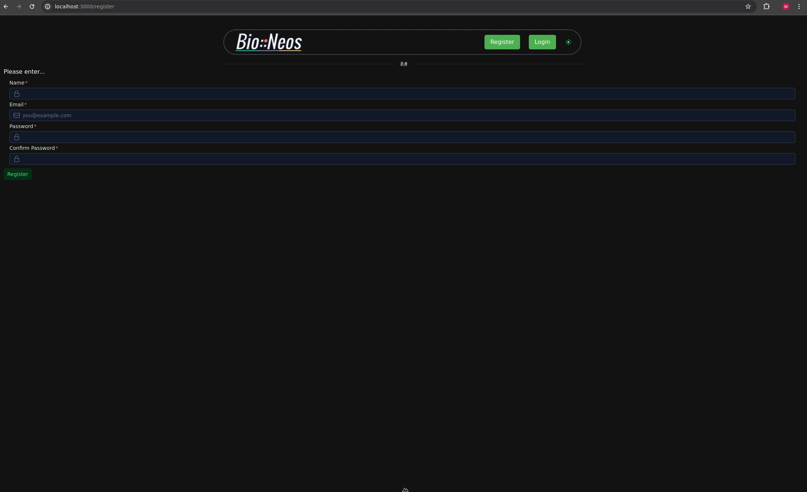
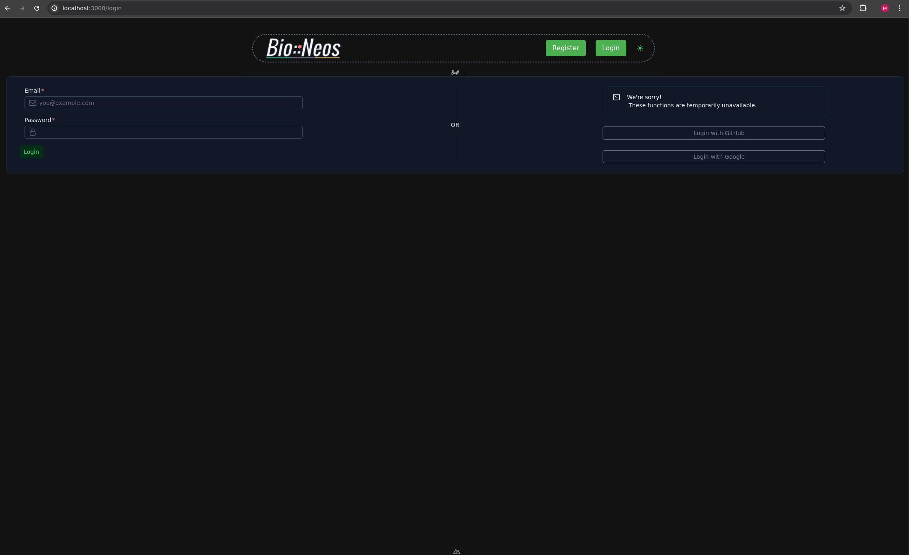
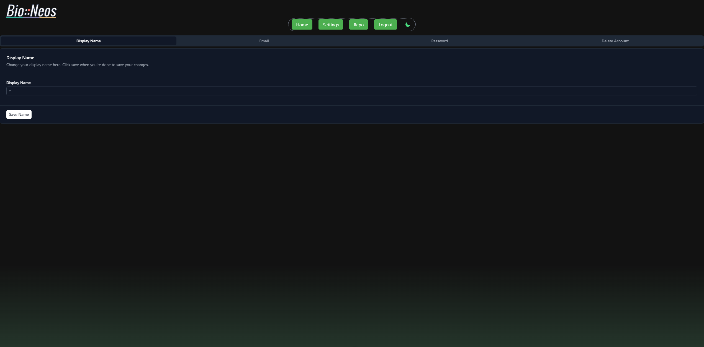
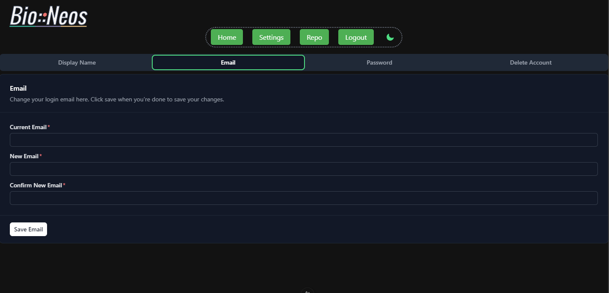
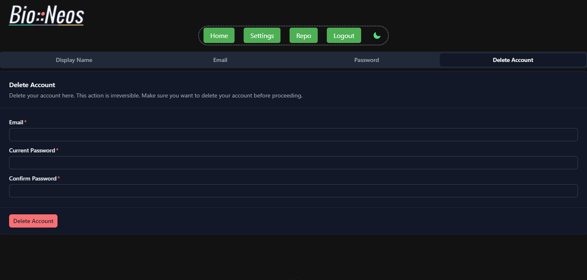

# Bio::Neos Development Skeleton

## Project Overview
We were tasked with designing and creating a development skeleton for future Bio::Neos interns to experiment with and build on. Given several options for the framework, we chose Nuxt.js and Vue due to their aesthetic appeal, strong documentation, and supportive community. Our primary goal was to develop an application with some loose ends to give future developers footholds to make it their own and gain valuable learning experiences. Additional goals included experimenting with new technologies, gaining a better understanding of the web development process, and creating a project that could serve as a showcase of our work.

### Project Goals and Uses
- **Primary Goal:** Provide a base for future development interns to use as a jumping-off point.
- **Secondary Goals:**
  - Experiment with unfamiliar technologies.
  - Enhance understanding of the web development process.
  - Create a demonstrative project for career development.

### Future Enhancements
- Branch and customize for personal projects/career development
- Use as guide for future interns

### Technologies used
- Nuxt 3.12
- Vue.js (either 2.7 or 3)
- MySQL
- Docker
- Bcrypt
- Prisma 5.15.0

## Getting Started

### Ensure you have the following installed: 
- Docker


### Installation

1. **Clone the repository:**

   ```sh
   git clone https://github.com/bioneos/training-project.git
   ```
2. **Set up the environment variables:**
- Create a `.env` file.
- Copy the contents of `dotenv.example` to your `.env` and update them with your desired values.

### Running the project

1. **Start the docker containers**

    ```sh 
    docker compose up --build 
    ```

### Installation

1. **Clone the repository:**

   ```sh
   git clone https://github.com/bioneos/training-project.git
   ```
2. **Set up the environment variables:**
- Create a `.env` file.
- Copy the contents of `dotenv.example` to your `.env` and update them with your desired values.

### Running the project

1. **Start the docker containers**

    ```sh 
    docker compose up --build 
    ```

2. **Access the application:**
- Open your browser and navigate to:
    ```sh
    http://localhost:${APP_PORT} 

    ```
    APP_PORT is the port value you set up in your `.env` file.

- The correct link will also come up in your container log when starting up the Docker container :

    

3. **Accessing your development environment**
- We want to write our code while inside of the app container created by docker (training-project-app-1). This can be done differently based on the IDE being used. We will show you how to do it in VSCode.

  - VSCode
    1. If not installed already, make sure you have the Remote Explorer extension installed. 

        

    2. Navigate to the Remote Explorer tab.

        
    
    3. Navigate to the training-project-app-1 container and click on the "Attach in current window option". 

        
    
    4. Now you can edit the files from within the container! To view the docker logs while in the container, navigate to the remote explorer tab and right-click the container. Select the "Show Container Log" option. Then the container will be displayed in the terminal tab!


        

        
## Features

### Landing Page
This is the page that appears when the application is first initialized.


### Register Page
- Accessible via the ‘Register’ button in the navigation bar.
- Requires a valid email address for registration.
- Users are prompted to log in after successful registration.



### Login Page
- Accessible via the ‘Login’ button in the navigation bar.
- Only registered accounts can log in.



### Color Mode :moon::sunny:
- Toggle button available on all pages in navigation bar.
- Switches between dark mode (moon icon) and light mode (sun icon).

### Welcome Page
- Displays a welcome message with the user’s name.
- Navigation options: Home, Settings, Repo (opens new tab), Logout.

  

### Settings Page
# Users are able to:
- Change their display name.
- Change their account email.
- Change their account password.
- Delete their account.

Changes are handled via API requests, handlers located in server folder









## Acknowledgements
- [Nuxt UI official documentation](https://ui.nuxt.com/getting-started)
- [Best README Template](https://github.com/othneildrew/Best-README-Template)
- [Nuxt installation guide](https://nuxt.com/docs/getting-started/installation#play-online)
- [Nuxt sandbox (StackBlitz)](https://stackblitz.com/github/nuxt/starter/tree/v3?file=README.md)
- [Getting Started With Nuxt UI by John Komarnicki](https://www.youtube.com/watch?v=SE_ysS_ZXbk&t=1272s)
- [Tailwind CSS styling help](https://tailwindcss.com/docs/flex-basis)
- [Consola Logging](https://github.com/unjs/consola)

## License
Distributed under the BSD 2-Clause License. See `LICENSE.md` for more information.

## Contact
For further information, contact:
- [mharbaugh@bioneos.com (Summer 2024 Development Intern)](mailto:mharbaugh@bioneos.com)
- [zhasabrabu@bioneos.com Summer 2024 Development Intern)](mailto:zhasabrabu@bioneos.com)
- [sgdavis@bioneos.com](mailto:sgdavis@bioneos.com)
